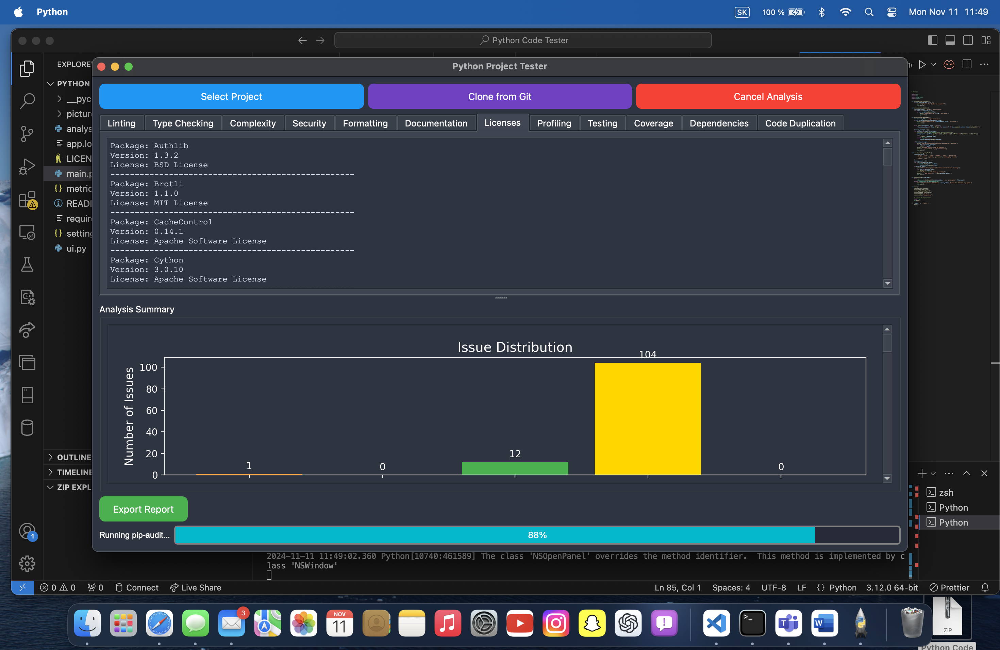
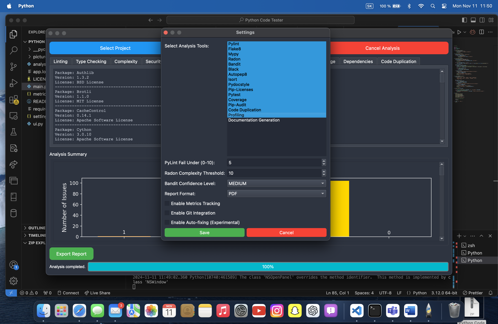
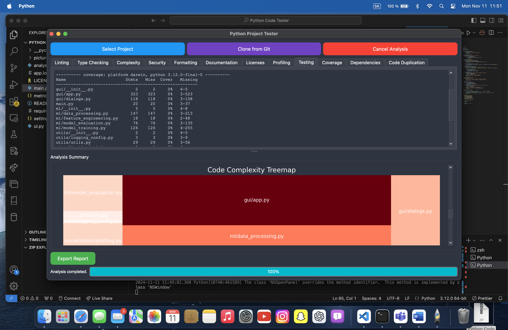

# Python Code Tester

## Project Description
The Python Code Tester is a versatile tool designed for testing, analyzing, and evaluating Python code through a streamlined interface. It allows users to run code, view metrics, log errors, and customize settings for various testing scenarios, making it ideal for both beginners and advanced developers.

## Features
- **User-Friendly Interface**: Simplified UI through `ui.py`, providing clear options for running tests and viewing results.
- **Code Analysis**: Detailed analysis with `analysis.py` to evaluate code performance and accuracy metrics.
- **Configurable Testing**: Modify `settings.json` to customize test parameters and behavior.
- **Metrics Tracking**: `metrics.json` logs test results and performance data for consistent tracking.
- **Comprehensive Logging**: Track application events and errors with `app.log`, assisting in debugging.

## Installation
1. **Clone the repository**:
   ```bash
   git clone <repository-url>
   ```
2. **Navigate to the project directory**:
   ```bash
   cd Python-Code-Tester
   ```
3. **Install dependencies**:
   Ensure you have Python 3.6+ installed, then run:
   ```bash
   pip install -r requirements.txt
   ```

## File Descriptions and Functions

### 1. `main.py`
   - **Purpose**: The main entry point to run the application. 
   - **Functions**:
     - `run_tests()`: Initializes testing routines and loads settings from `settings.json`.
     - `generate_report()`: Compiles test results into `metrics.json` for post-test review.
   - **Usage**:
     Run `main.py` to start the application, execute tests, and view results.

### 2. `ui.py`
   - **Purpose**: Provides the graphical user interface (GUI) for user interaction.
   - **Functions**:
     - `initialize_ui()`: Sets up the initial layout, buttons, and inputs for the application interface.
     - `display_results()`: Shows real-time test results and feedback to the user.
   - **Usage**: `ui.py` is called within `main.py`, so no separate action is needed. Use the GUI to initiate tests and view outputs.

### 3. `analysis.py`
   - **Purpose**: Analyzes code performance and calculates relevant metrics.
   - **Functions**:
     - `evaluate_code_quality()`: Runs quality checks on the tested code, assessing aspects like efficiency and adherence to coding standards.
     - `calculate_performance_metrics()`: Measures and logs performance data (e.g., execution time).
   - **Usage**: `analysis.py` is invoked by `main.py` during testing, so results appear automatically in the metrics.

### 4. `settings.json`
   - **Purpose**: Stores configurations for the code tester (e.g., test parameters, code quality thresholds).
   - **Structure**:
     ```json
        {
        "selected_tools": [
            "Pylint",
            "Mypy",
            "Radon",
            "Bandit",
            "Black",
            "Pydocstyle",
            "Pip-Licenses",
            "Pytest",
            "Pip-Audit",
            "Autopep8",
            "Isort",
            "Flake8"
        ],
        "pylint_fail_under": 5,
        "radon_threshold": 10,
        "bandit_confidence": "MEDIUM",
        "report_format": "PDF",
        "enable_git_integration": false,
        "enable_autofix": false,
        "enable_metrics_tracking": false
        }
     ```
   - **Usage**: Edit `settings.json` to modify testing parameters. Adjust values as needed, and `main.py` will read these on startup.

### 5. `metrics.json`
   - **Purpose**: Logs testing results and metrics for each session.
   - **Sample Structure**:
     ```json
     {
       "execution_time": 1.8,
       "memory_usage": 485,
       "code_quality": 95
     }
     ```
   - **Usage**: View `metrics.json` after running tests to examine performance and quality scores.

### 6. `app.log`
   - **Purpose**: Logs events, errors, and warnings, helping to debug and monitor the app.
   - **Usage**: Check `app.log` for any runtime issues or detailed logs of application events.

## Step-by-Step Usage Tutorial
1. **Prepare Your Settings**: Open `settings.json` and customize testing parameters as needed. For example, adjust `"test_iterations"` to control the number of test repetitions.
2. **Run the Application**:
   ```bash
   python main.py
   ```
3. **Interact with the GUI**:
   - **Start Tests**: In the UI, click the "Start Test" button to begin testing your code based on the configurations.
   - **View Real-Time Results**: As the code executes, results are displayed in real-time.
4. **Analyze Results**:
   - Open `metrics.json` to review execution time, memory usage, and code quality metrics.
   - Use this data to make necessary optimizations to your code.
5. **Debugging**: If any issues occur, refer to `app.log` for detailed error and event logs.

## Project Gallery
Here are some images showcasing the Python Code Tester interface and functionality. *(Please add the images to the `pictures` folder)*

1. 
2. 
3. 

## Contributing
Contributions are welcome! Please submit a pull request or open an issue to suggest changes or improvements.

## Contact
For questions, please reach out to the project maintainer at samuellabant@192.

## License
This project is licensed under the MIT License. See the `LICENSE` file for details.
